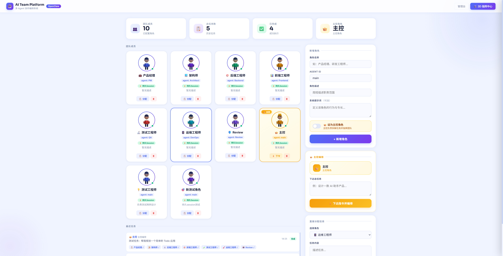

# 🤖 AI Team Platform

> 基于 OpenClaw 的 AI 多角色协作平台 —— 组建你的 AI 团队，完成复杂任务编排


---

## ✨ 核心特性

| 特性 | 说明 |
|------|------|
| 🧑‍💼 **多角色管理** | 定义产品经理、架构师、工程师等任意角色，每个角色有独立 system prompt |
| ⚡ **持久化 Session** | 每个角色拥有独立长期 session，保留上下文记忆，跨任务连续对话 |
| 🎯 **主控编排** | 主控角色自动拆解任务、分发给各成员、并行执行、汇总结果 |
| 📋 **实时日志** | 点击正在执行的角色卡片，查看实时执行状态与完整结果 |
| 📊 **任务历史** | 查看所有历史任务，随时回溯各角色的执行结果 |
| 🔌 **SSE 推送** | 基于 Server-Sent Events，编排过程实时流式展示 |

---

## 🖥️ 界面预览



> 多角色团队管理 + 主控编排面板 + 实时任务历史

---

## 🚀 快速开始

### 环境要求

- Python 3.11+
- OpenClaw 内网版（已配置并运行）
- OpenClaw Gateway Token（用于 sessions_spawn / sessions_send）

### 安装依赖

```bash
cd ai_team_platform
pip install -r requirements.txt
```

### 启动服务

```bash
python main.py
```

服务默认运行在 **http://localhost:8765**

> 📝 日志文件：`/tmp/ai_team.log`

---

## 📁 项目结构

```
ai_team_platform/
├── main.py              # FastAPI 服务入口 + REST API
├── team_manager.py      # 核心：团队管理 + 编排引擎
├── models.py            # 数据模型（AgentRole / TeamTask / SubTaskResult）
├── static/
│   └── index.html       # 前端单页应用（无构建工具）
├── requirements.txt     # Python 依赖
└── README.md
```

---

## 🔌 API 接口

### 角色管理

| 方法 | 路径 | 说明 |
|------|------|------|
| `GET` | `/roles` | 获取所有角色列表 |
| `POST` | `/roles` | 新增角色（自动初始化持久 session） |
| `DELETE` | `/roles/:id` | 删除角色 |
| `POST` | `/roles/:id/init-session` | 手动重置角色 session |

### 任务编排

| 方法 | 路径 | 说明 |
|------|------|------|
| `GET` | `/tasks` | 获取历史任务列表 |
| `POST` | `/tasks/orchestrate` | 发起多角色编排任务 |
| `GET` | `/tasks/:id` | 获取任务详情（含子任务） |
| `GET` | `/tasks/:id/sub/:role_id` | 获取指定角色的子任务结果 |

### 实时推送

| 路径 | 说明 |
|------|------|
| `GET /events` | SSE 事件流（编排状态实时推送） |

---

## 🧩 角色 Session 机制

```
角色创建
   │
   ▼
自动 spawn 持久 session（OpenClaw subagent）
   │
   ▼
session_key 存储到角色配置
   │
   ├── 任务到来时 → sessions_send（保留上下文）
   │
   └── session 失效时 → 自动降级为 spawn 新 subagent
```

每个角色的持久 session 会记住自己的身份和历史交互，实现真正的"角色连续性"。

---

## ⚙️ 配置说明

### Gateway Tools 权限

本平台需要以下 Gateway 工具权限，在 `openclaw.json` 中配置：

```json
{
  "gateway": {
    "tools": {
      "allow": [
        "sessions_spawn",
        "sessions_send",
        "sessions_history",
        "sessions_list"
      ]
    }
  }
}
```

### 环境变量

| 变量 | 默认值 | 说明 |
|------|--------|------|
| `OPENCLAW_GATEWAY_PORT` | `23001` | OpenClaw Gateway 端口 |
| `LLM_BASE_URL` | `http://localhost:11434/v1` | 本地 LLM 地址（fallback 用） |

---

## 🏗️ 技术架构

```
前端（单页应用）
  │  Vanilla JS + Fetch API + SSE
  │
  ▼
FastAPI 服务（main.py）
  │  REST API + SSE 事件流
  │
  ▼
TeamManager（team_manager.py）
  │  编排引擎 + 角色管理 + Session 池
  │
  ├──→ OpenClaw Gateway（sessions_spawn / sessions_send）
  │       └──→ Subagent（各角色独立 session）
  │
  └──→ 本地 LLM（ollama，fallback）
```

**调用优先级：**
1. 持久化 session（`sessions_send`）— 保留上下文
2. 临时 subagent（`sessions_spawn`）— session 失效时
3. 本地 LLM（`ollama`）— Gateway 不可用时
4. 规则 fallback — 最终兜底

---

## 📝 开发计划

- [x] 多角色管理
- [x] 主控编排（并行子任务）
- [x] 实时执行日志抽屉
- [x] 持久化角色 session
- [x] 历史任务子角色结果查看
- [ ] 角色间消息传递（非主控模式）
- [ ] 任务模板库
- [ ] 多团队支持

---

## 📄 License

MIT © 2026
